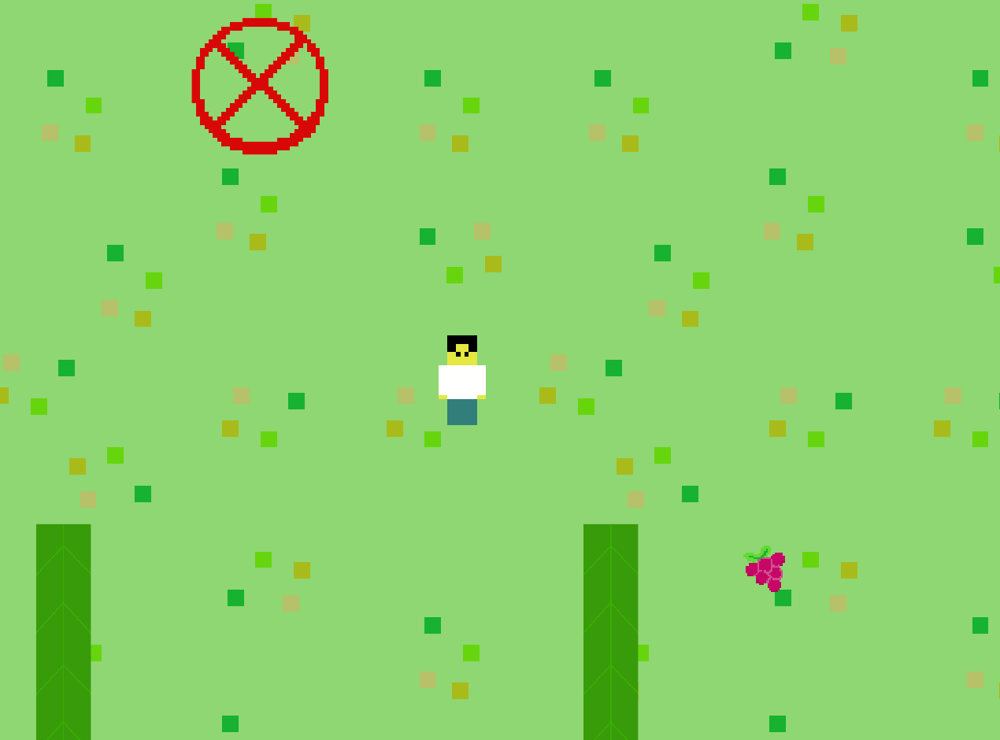

# bevy-maze-game
This is a simple 2d random maze game made by bevy and bevy_rapier.
The exit is in the upper left, and the energy is maintained by eating food, and once the energy falls below 0, the game progress is re-refreshed.

### cargo run to compile and run the project

### example
